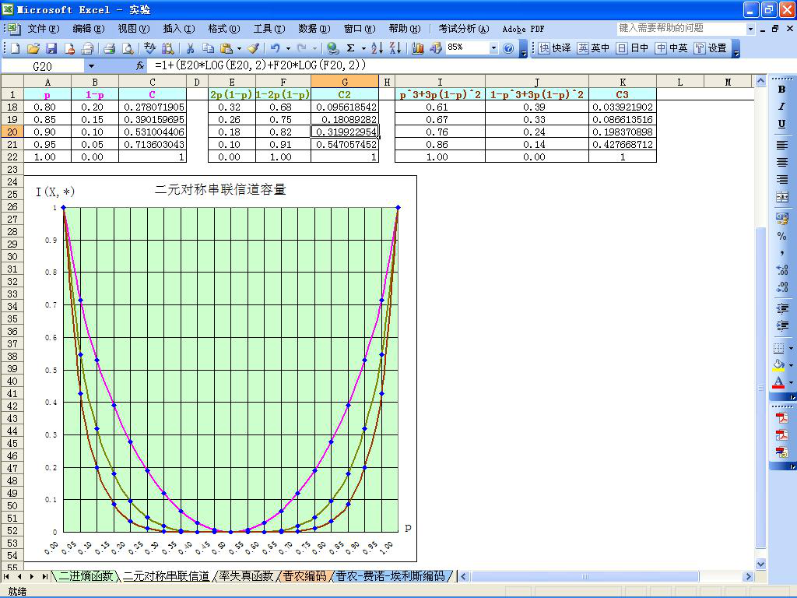
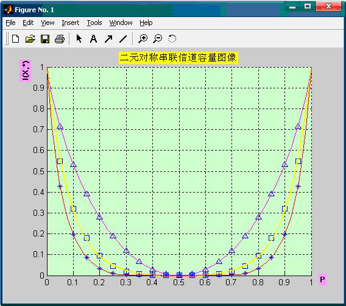

# 实验五、串联信道容量函数曲线绘制

## 实验内容

用 Excel 或 Matlab 制作串联信道容量曲线。

## 实验环境

1. 计算机
2. Windows 2000 或以上
3. Microsoft Office XP 或以上
4. Matlab 6.5 或以上

## 实验目的

1. 掌握 Excel 的数据填充、公式运算和图表制作
2. 掌握 Matlab 绘图函数
3. 掌握、理解串联信道的信道容量结论

## 实验要求

1. 提前预习实验，认真阅读实验原理以及相应的参考书。
2. 认真高效的完成实验，实验中服从实验室管理人员以及实验指导老师的管理。
3. 认真填写实验报告。

## 实验原理

Excel 的图表功能（略），串联信道的信道容量（下图）。参考《信息论——基础理论及应用》的 124 页。

## 实验地址

- [串联信道容量曲线绘制](https://info-lab.wangding.in/labs/lab05.html)
  
## 实验结果

1. 在 Excel 中绘制的函数曲线图，请参考下图。

  

2. 在 Matlab 中绘制的函数曲线图，请参考下图。

  

